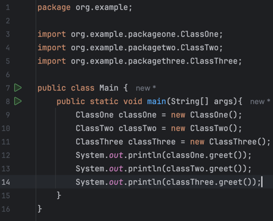
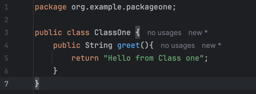
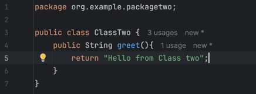
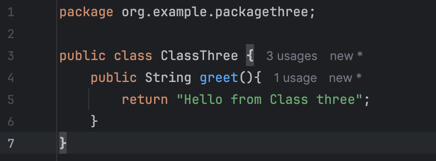
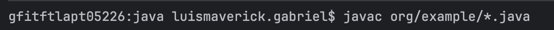
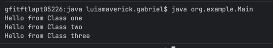
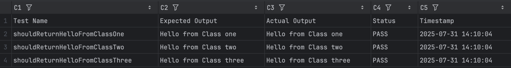

# Laboratory: Java Packages
## By: Gabriel, Luis Maverick L.

### Code
- **Main**

- **packageone.ClassOne**

- **packagetwo.ClassTwo**

- **packagethree.ClassThree**

### Compilation

### Output

### Test Result
